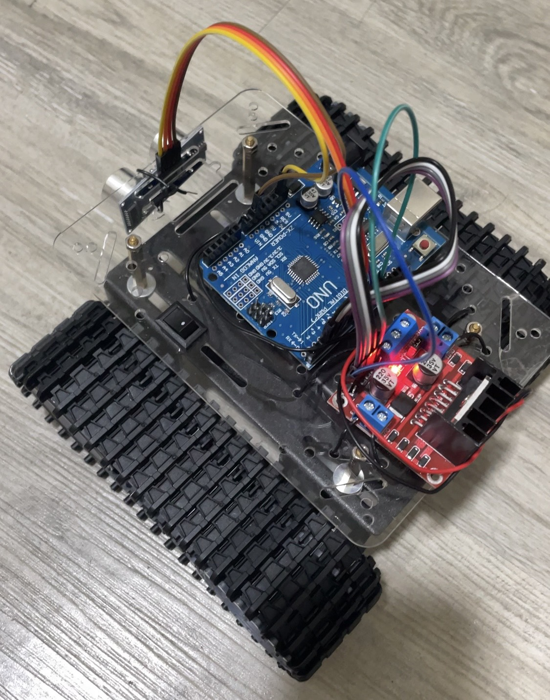
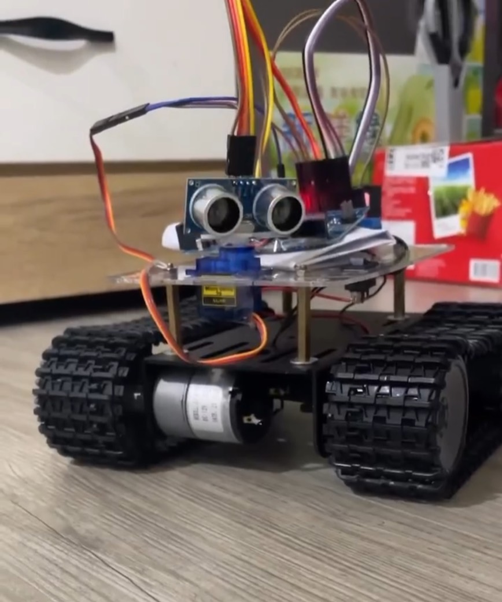

# 🚗 Arduino 避障自走車系統
---
# 📌 專案簡介

本專案使用 Arduino UNO 搭配超音波感測器與馬達模組，實作一台自動避障功能自走車。

系統透過三顆 HC-SR04 超音波感測器
（左 / 中 / 右）
即時偵測周圍障礙物距離，
並根據距離判斷移動方向。

---

# 🧠 功能特色

✅ 三方向超音波距離偵測  
✅ 自動避障功能  
✅ 左右方向判斷  
✅ 前進 / 後退 / 轉向控制  
✅ Arduino 馬達控制   

---

# ⚙️ 使用硬體

- Arduino UNO
- HC-SR04 超音波感測器 ×3
- L298N 馬達驅動模組
- TT 馬達
- 自走車底盤
- 電池模組
- 履帶

---

# 🖼️ 系統架構

```text
超音波感測器
      ↓
Arduino UNO
      ↓
距離判斷邏輯
      ↓
L298N 馬達控制
      ↓
自走車移動
```

---

# 🚘 避障邏輯

```text
前方無障礙
      ↓
持續前進

前方偵測障礙物
      ↓
後退
      ↓
比較左右距離
      ↓
選擇空間較大的方向轉彎
```

---

# 📂 專案檔案

```text
Arduino-Obstacle-Avoidance-Car/
│
├── obstacle_car.ino
├── README.md
│
├── images/
│   ├── car1.jpg
│   ├── car1 SAND TEST.jpg
│   ├── car2 SAND TEST.jpg
│   └── SF90.jpg
```

---

# 🛠️ 使用技術

- Arduino C++
- HC-SR04
- L298N
- Embedded System
- Sensor Integration

---

# 📸 成果展示

## 自走車本體

---

## 電路配置


---

## 運作畫面

---
# 🔄 系統演進與測試歷程

本專案在開發過程中經歷多次架構調整與測試優化，逐步提升避障穩定性。

## 🧪 第一階段：單一超音波感測器

僅使用一顆超音波感測器進行前方偵測，當遇到障礙物時進行固定或隨機轉向。

⚠️ 問題
- 無法判斷左右空間
- 容易形成繞圈行為
- 避障效果不穩定


## 🧪 第二階段：伺服馬達掃描感測

將單一超音波感測器安裝於伺服馬達上，透過 0° / 90° / 180° 進行掃描，模擬多方向感測。

⚠️ 問題
- 掃描時間過長導致反應延遲
- 機械轉動影響即時性
- 測距誤差影響決策


## 🧪 第三階段：三超音波感測器（最終架構）

改為固定式三感測器（左 / 中 / 右），即時回傳距離資訊。

✔️ 優點
- 即時取得方向資訊
- 避免掃描延遲
- 提升整體穩定性


# 🔧 開發過程與遇到問題

## 1️⃣ 履帶長度不一致

專案初期使用網路購買的「履帶式自走車底盤」進行組裝，實際測試後發現左右履帶長度存在差異。

造成自走車在直線行駛時，
會持續向其中一側偏移，
影響避障判斷與行走穩定性。

曾嘗試以下解決方式：

- 手動拆除履帶其中一節
- 調整履帶鬆緊程度
- 嘗試透過馬達速度平衡修正方向

但由於使用的馬達不支援速度控制（無 PWM 調速功能），
因此無法透過程式精確修正左右速度差異。

最終僅能透過：

- 車體結構調整
- 履帶鬆緊微調
- 轉向時間修正

來降低偏移問題。

---

## 2️⃣ 沙灘地形造成車體卡住

在室內平坦地面測試時，
自走車可正常行駛。

但實際移至沙灘地形後，
由於車身底部離地高度不足，
導致底盤容易直接摩擦沙面而卡住。

為了解決此問題，
後續重新設計並訂製壓克力車架，
將車體整體抬高，
提升離地高度以增加沙地通行能力。

---

## 3️⃣ 馬達進沙導致故障

即使完成車身抬高後，
自走車仍在長時間沙灘測試中出現新的問題。

由於沙灘環境中的細沙容易進入 TT 馬達內部，
導致：

- 馬達轉動阻力增加
- 馬達齒輪卡死
- 車輛無法繼續行駛

此問題對專案影響較大，
也讓團隊意識到：

實際戶外環境與室內測試存在很大差異。

## 4️⃣距離測量誤差

在實作中發現超音波感測器存在誤差問題：

- 偶發讀值為 0
- 測距不穩定
- 瞬間跳動數值

為了解決此問題，
改為多次測量取平均值，減少錯誤判斷提升穩定性，但仍無法完全消除極端誤差
---

## 💡 專案開發心得

本專案除了程式開發外，
也涉及大量硬體整合與實際環境測試。

在開發過程中，
許多問題並非程式本身造成，
而是來自：

- 機構設計
- 地形限制
- 硬體品質
- 環境因素

雖然過程中遇到許多限制與挑戰，
但也因此更加理解：

實際工程開發需要同時考量軟體與硬體的整合能力。

# ⚠️ 專案限制

目前系統使用簡易避障邏輯，
尚未導入：

- SLAM
- 路徑規劃
- 地圖建構
- AI 導航

本專案主要以基礎嵌入式控制與避障功能實作為主。

---

# 📈 未來可擴充方向

- ESP32 Camera 整合
- YOLO 即時辨識
- WiFi 傳輸
- 即時監控 Dashboard
- 機械手臂

---

# 👨‍💻 作者

Sam Lin